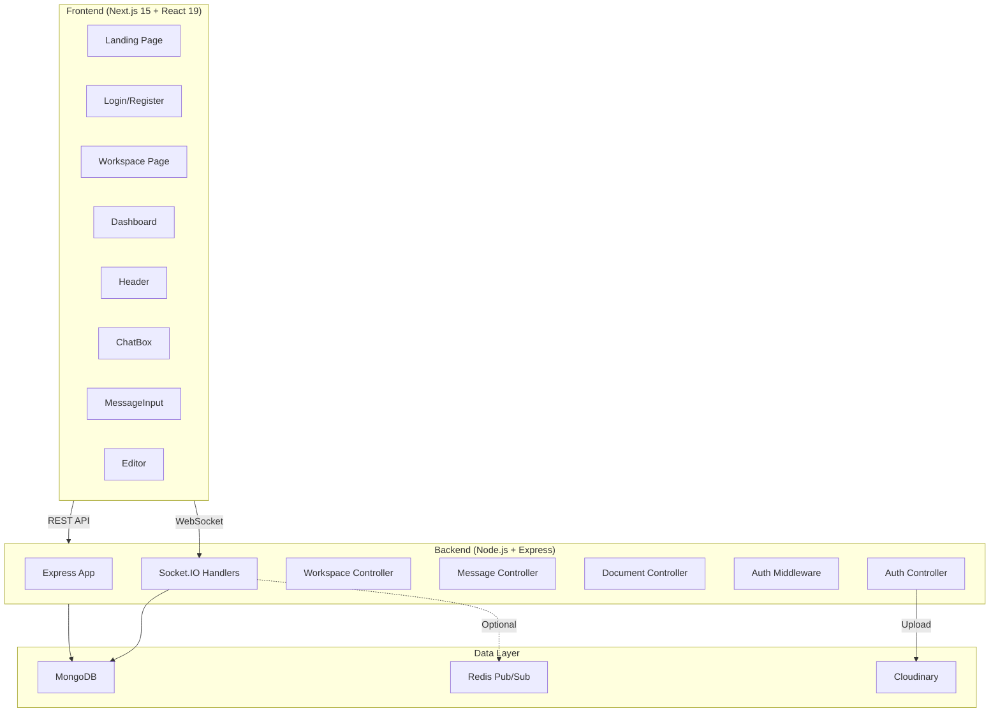
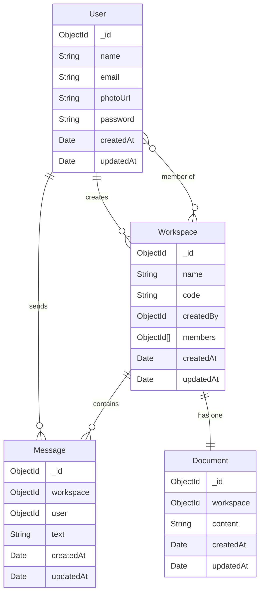

# CollabX — Full Codebase Analysis

**A real-time collaboration platform with chat, shared documents, and workspace management.**

---

## Architecture Overview



---

## Tech Stack

| Layer | Technology | Version |
|-------|-----------|---------|
| **Frontend Framework** | Next.js (App Router) | 15.3.0 |
| **UI Library** | React | 19.1.0 |
| **Language** | TypeScript | 5.8.3 |
| **Styling** | Tailwind CSS | 4.2.2 |
| **HTTP Client** | Axios | 1.9.0 |
| **Realtime (Client)** | socket.io-client | 4.8.1 |
| **Backend Framework** | Express | 4.21.2 |
| **Realtime (Server)** | Socket.IO | 4.8.1 |
| **Database** | MongoDB (Mongoose) | 8.14.2 |
| **Cache/PubSub** | Redis | 5.12.1 |
| **Auth** | JWT (jsonwebtoken) | 9.0.2 |
| **Password Hashing** | bcryptjs | 3.0.2 |
| **File Upload** | Multer + Cloudinary | 2.1.1 / 2.7.0 |

---

## Project Structure

```
CollabX/
├── client/                          # Next.js frontend
│   ├── app/
│   │   ├── layout.tsx               # Root layout with Header
│   │   ├── page.tsx                 # Landing page (317 lines)
│   │   ├── globals.css              # Global styles
│   │   ├── login/page.tsx           # Auth page (273 lines)
│   │   ├── workspace/page.tsx       # Main workspace (1387 lines) ⚠️
│   │   └── dashboard/page.tsx       # Dashboard (167 lines)
│   ├── components/
│   │   ├── Header.tsx               # Navigation header
│   │   ├── ChatBox.tsx              # Chat message list + edit/delete
│   │   ├── MessageInput.tsx         # Message composer with typing
│   │   └── Editor.tsx               # Collaborative document editor
│   ├── lib/
│   │   ├── api.ts                   # Axios instance with JWT interceptor
│   │   └── socket.ts               # Socket.IO singleton
│   └── types/index.ts              # TypeScript type definitions
│
├── server/                          # Node.js backend
│   └── src/
│       ├── server.js                # Entry point, HTTP + Socket.IO
│       ├── app.js                   # Express app factory
│       ├── config/
│       │   ├── db.js                # MongoDB connection
│       │   └── redis.js             # Redis pub/sub (graceful fallback)
│       ├── models/
│       │   ├── User.js              # name, email, photoUrl, password
│       │   ├── Workspace.js         # name, code, createdBy, members
│       │   ├── Message.js           # workspace, user, text
│       │   └── Document.js          # workspace, content
│       ├── controllers/
│       │   ├── auth.controller.js   # register, login, me, profile, photo, password
│       │   ├── workspace.controller.js  # CRUD + join/leave/transfer/members
│       │   ├── message.controller.js
│       │   └── document.controller.js
│       ├── routes/
│       │   ├── auth.routes.js
│       │   ├── workspace.routes.js
│       │   ├── document.routes.js
│       │   └── message.routes.js
│       ├── middleware/
│       │   ├── auth.middleware.js    # JWT verification
│       │   └── upload.middleware.js  # Multer config
│       ├── sockets/
│       │   └── chat.socket.js       # All realtime handlers (530 lines)
│       └── utils/
│           ├── generateToken.js
│           ├── cloudinary.js
│           └── workspace-access.js
└── README.md
```

---

## Feature Inventory

### ✅ Implemented Features

| Feature | Status | Details |
|---------|--------|---------|
| **User Registration** | ✅ Complete | Name, email, password with validation |
| **User Login** | ✅ Complete | JWT-based, token stored in localStorage |
| **Profile Management** | ✅ Complete | Update name, photo URL, password |
| **Photo Upload** | ✅ Complete | Multer → Cloudinary pipeline |
| **Workspace CRUD** | ✅ Complete | Create, join via code, leave, delete |
| **Ownership Transfer** | ✅ Complete | Transfer workspace creator role |
| **Member Management** | ✅ Complete | View members, remove members (creator only) |
| **Real-time Chat** | ✅ Complete | Send, edit, delete messages via Socket.IO |
| **Typing Indicators** | ✅ Complete | Chat + Document typing with auto-timeout |
| **Collaborative Editor** | ✅ Complete | Shared document with auto-save (500ms debounce) |
| **Unread Counts** | ✅ Complete | Badge on inactive workspace tabs |
| **Browser Notifications** | ✅ Complete | Desktop push when tab is hidden |
| **In-app Toast Notifications** | ✅ Complete | For messages in non-active workspaces |
| **Redis Pub/Sub** | ✅ Complete | Multi-instance scaling with graceful fallback |
| **Graceful Shutdown** | ✅ Complete | SIGINT/SIGTERM handlers |
| **CORS Configuration** | ✅ Complete | Dynamic origin with localhost fallback |

### API Endpoints

```
POST   /api/auth/register        — Create account
POST   /api/auth/login            — Sign in
GET    /api/auth/me               — Current user (protected)
PUT    /api/auth/profile          — Update name/photo (protected)
POST   /api/auth/profile-photo   — Upload photo file (protected)
PUT    /api/auth/password         — Change password (protected)

GET    /api/workspaces            — List user's workspaces (protected)
POST   /api/workspaces            — Create workspace (protected)
POST   /api/workspaces/join       — Join via code (protected)
POST   /api/workspaces/:id/leave  — Leave workspace (protected)
DELETE /api/workspaces/:id        — Delete workspace (protected, creator only)
POST   /api/workspaces/:id/transfer — Transfer ownership (protected, creator only)
GET    /api/workspaces/:id/members — Get member list (protected)
DELETE /api/workspaces/:id/members/:memberId — Remove member (protected, creator only)

GET    /api/messages/:workspaceId — Message history (protected)
GET    /api/document/:workspaceId — Get shared document (protected)
GET    /api/health                — Health check
```

### Socket.IO Events

| Event | Direction | Purpose |
|-------|-----------|---------|
| `join-workspace` | Client → Server | Join a workspace room |
| `join-document` | Client → Server | Join document collaboration room |
| `leave-document` | Client → Server | Leave document room |
| `send-message` | Client → Server | Send chat message |
| `update-message` | Client → Server | Edit own message |
| `delete-message` | Client → Server | Delete own message |
| `typing-status` | Client → Server | Chat typing indicator |
| `document-typing` | Client → Server | Document typing indicator |
| `edit-document` | Client → Server | Update shared document |
| `new-message` | Server → Client | New message broadcast |
| `message-updated` | Server → Client | Edited message broadcast |
| `message-deleted` | Server → Client | Deleted message broadcast |
| `typing-status` | Server → Client | Typing indicator broadcast |
| `document-updated` | Server → Client | Document changes broadcast |
| `document-typing-updated` | Server → Client | Document typing broadcast |

---

## Code Quality Assessment

### 🟢 Strengths

1. **Clean Architecture** — Clear separation of concerns: routes → controllers → models. Socket handlers in their own module.
2. **Graceful Redis Fallback** — Redis is optional. If unavailable, events broadcast locally via Socket.IO. No crashes.
3. **Robust Error Handling** — Every controller has try/catch, descriptive error messages, and proper HTTP status codes.
4. **Input Validation** — Both client and server validate inputs (name length, email format, password minimum).
5. **Security Basics** — JWT auth on both REST and WebSocket, bcrypt password hashing, workspace membership checks on every socket event.
6. **Smart UX Patterns** — Auto-scroll only when near bottom (WhatsApp-like), typing indicators with timeouts, clipboard copy feedback, confirm dialogs for destructive actions.
7. **Well-Designed Landing Page** — Modern, clean design with hero section, feature cards, CTA, and animated elements.

### 🟡 Areas for Improvement

1. **Workspace Page is Monolithic** — At **1,387 lines**, [workspace/page.tsx](file:///c:/Shrikant/website/CollabX/client/app/workspace/page.tsx) contains ~30 state variables, ~15 handler functions, and the entire sidebar/main/modal UI. This should be decomposed into smaller components.

2. **No Rate Limiting** — The API has no rate limiting on authentication endpoints, which is a security risk for brute-force attacks.

3. **No Input Sanitization** — Message text and document content are stored and rendered as-is. Consider XSS protection.

4. **Last-Write-Wins for Documents** — The collaborative editor uses a simple last-write-wins strategy with 500ms debounce. With concurrent editors, content can be overwritten. Consider OT or CRDT for true collaborative editing.

5. **No Pagination** — Messages are loaded all at once (`GET /messages/:id`). For workspaces with many messages, this will degrade performance. Implement cursor-based pagination.

6. **Token in localStorage** — JWTs stored in `localStorage` are vulnerable to XSS attacks. Consider `httpOnly` cookies.

7. **No Token Expiry Handling** — JWTs don't appear to have expiry handling on the client. If a token expires, the user gets API errors instead of being redirected to login.

8. **Duplicate CORS Logic** — `isAllowedOrigin` is defined in both [server.js](file:///c:/Shrikant/website/CollabX/server/src/server.js#L12-L22) and [app.js](file:///c:/Shrikant/website/CollabX/server/src/app.js#L9-L19). Should be extracted to a shared utility.

9. **Missing Tests** — No unit or integration tests exist in the project.

10. **`any` Type Usage** — [workspaceMembers](file:///c:/Shrikant/website/CollabX/client/app/workspace/page.tsx#L58) uses `any[]` instead of a proper type.

11. **Dashboard Uses Legacy Styles** — The [dashboard page](file:///c:/Shrikant/website/CollabX/client/app/dashboard/page.tsx) uses class names like `shell`, `panel`, `muted`, `eyebrow` which seem from an older CSS system, while other pages use Tailwind. Inconsistent styling.

12. **No Loading States for Workspace Actions** — Creating/joining a workspace doesn't show loading feedback.

### 🔴 Potential Issues

1. **Race Condition on Workspace Code Generation** — [generateUniqueCode()](file:///c:/Shrikant/website/CollabX/server/src/controllers/workspace.controller.js#L14-L24) checks and creates in separate steps. Under high concurrency, duplicate codes could theoretically be generated (mitigated by the unique index).

2. **Memory Leak Risk** — Typing timeout refs in the workspace page accumulate entries. While timeouts are cleared on unmount, the ref objects themselves aren't cleaned during long sessions.

3. **No CSRF Protection** — No CSRF tokens are implemented. The reliance on JWT in Authorization header provides some protection, but it's not comprehensive.

---

## Database Schema



---

## Summary Stats

| Metric | Count |
|--------|-------|
| **Total Source Files** | ~30 |
| **Frontend Pages** | 4 (Landing, Login, Workspace, Dashboard) |
| **React Components** | 4 (Header, ChatBox, MessageInput, Editor) |
| **API Routes** | 14 endpoints |
| **Socket Events** | 15 events |
| **Mongoose Models** | 4 (User, Workspace, Message, Document) |
| **Backend Controllers** | 4 |
| **Largest File** | workspace/page.tsx (1,387 lines) ⚠️ |

> [!TIP]
> The project is well-structured for a Day 1 MVP. The most impactful next steps would be:
> 1. **Decompose workspace/page.tsx** into smaller components
> 2. **Add message pagination** for scalability
> 3. **Add rate limiting** to auth endpoints
> 4. **Write tests** for controllers and socket handlers
> 5. **Upgrade the collaborative editor** from last-write-wins to OT/CRDT
